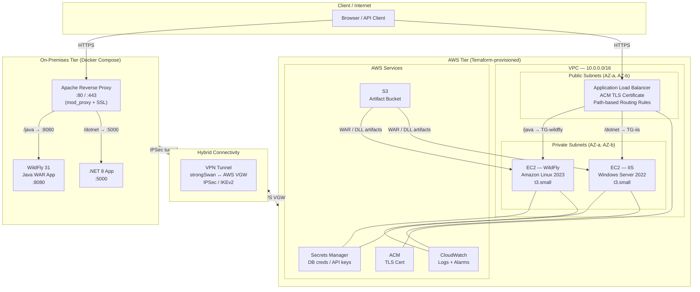

# NexusMidplane

**Hybrid Cloud Middleware Infrastructure Platform** — A DevOps portfolio project demonstrating enterprise-grade middleware automation across AWS cloud and simulated on-premises environments.

---

## Project Overview

NexusMidplane provisions and configures a dual-stack middleware platform running **WildFly (Java EE)** and **IIS/.NET** behind a shared reverse proxy. The infrastructure spans two environments managed as code:

| Environment | Technology | Purpose |
|---|---|---|
| **On-Prem (simulated)** | Docker Compose | Apache proxy + WildFly + .NET app containers |
| **AWS Cloud** | Terraform + Ansible | VPC, ALB, EC2 (Linux + Windows), ACM, Secrets Manager |

Path-based routing directs `/java/*` to WildFly and `/dotnet/*` to IIS across both tiers. A VPN tunnel bridges the environments for hybrid workload scenarios.

---

## Architecture



---

## Technology Stack

| Category | Tool / Service | Purpose |
|---|---|---|
| **IaC** | Terraform >= 1.5 | AWS infrastructure provisioning |
| **Config Mgmt** | Ansible >= 2.15 | WildFly + IIS configuration, app deployment |
| **Containers** | Docker + Compose | On-prem environment simulation |
| **CI/CD** | GitHub Actions | Build, test, deploy pipelines |
| **Java Middleware** | WildFly 31 (JBoss EAP OSS) | Java EE application server |
| **Windows Middleware** | IIS 10 + .NET 8 | Windows application server |
| **Reverse Proxy** | Apache httpd 2.4 | On-prem load balancing and routing |
| **Load Balancer** | AWS ALB | Cloud-tier path-based routing |
| **TLS (Cloud)** | AWS ACM | Automated certificate lifecycle |
| **TLS (On-Prem)** | Self-signed / Let's Encrypt | Manual certificate management |
| **Secrets** | AWS Secrets Manager | Credential storage and rotation |
| **Monitoring** | CloudWatch + Ansible | Logs, metrics, and alerting |
| **Artifact Store** | AWS S3 | WAR files, DLL packages |
| **VPN** | strongSwan + AWS VGW | Hybrid site-to-site connectivity |
| **Scripting** | Bash + PowerShell | Automation and tooling |

---

## Repository Structure

```
nexusmidplane/
├── terraform/               # AWS infrastructure (VPC, ALB, EC2, ACM, S3, etc.)
│   ├── modules/
│   │   ├── networking/      # VPC, subnets, IGW, route tables
│   │   ├── compute/         # EC2 instances (Linux + Windows)
│   │   ├── alb/             # Application Load Balancer + target groups
│   │   └── security/        # Security groups, IAM roles
│   ├── main.tf
│   ├── variables.tf
│   └── outputs.tf
├── ansible/                 # Configuration management playbooks
│   ├── inventory/           # Dynamic AWS inventory + static on-prem
│   ├── roles/
│   │   ├── wildfly/         # JBoss/WildFly install + deploy
│   │   ├── iis/             # IIS feature install + site config
│   │   └── common/          # Baseline hardening, monitoring agents
│   └── site.yml             # Master playbook
├── docker/                  # On-prem simulation
│   ├── apache/              # Apache reverse proxy config
│   ├── wildfly/             # WildFly container + sample WAR
│   └── dotnet/              # .NET 8 application container
├── app/                     # Sample applications
│   ├── java-api/            # Maven project → WAR artifact
│   └── dotnet-api/          # ASP.NET Core minimal API
├── pipelines/               # CI/CD
│   └── .github/workflows/
│       ├── build.yml        # Build + test on PR
│       ├── deploy-onprem.yml
│       ├── deploy-aws.yml
│       └── destroy.yml      # Teardown workflow
├── scripts/
│   ├── teardown-aws.sh      # Safe destroy with confirmation
│   ├── rotate-secrets.sh    # Secrets Manager rotation helper
│   └── health-check.sh      # End-to-end smoke test
└── docs/
    ├── architecture.md      # Detailed architecture notes
    ├── runbook.md           # Operational runbook
    └── cost-analysis.md     # Detailed cost breakdown
```

---

## Prerequisites

| Tool | Minimum Version | Install |
|---|---|---|
| Terraform | >= 1.5 | `brew install terraform` / [tfenv](https://github.com/tfutils/tfenv) |
| Ansible | >= 2.15 | `pip install ansible` |
| Ansible AWS collection | latest | `ansible-galaxy collection install amazon.aws` |
| Docker + Compose | >= 24.0 | [Docker Desktop](https://www.docker.com/products/docker-desktop/) |
| AWS CLI | v2 | `brew install awscli` |
| Java | 17 | `sdk install java 17` (SDKMAN) |
| Maven | >= 3.9 | `brew install maven` |
| .NET SDK | 8.0 | [dotnet.microsoft.com](https://dotnet.microsoft.com/download) |
| Python | >= 3.10 | Required by Ansible |

Configure AWS credentials before running Terraform:

```bash
aws configure --profile nexusmidplane
export AWS_PROFILE=nexusmidplane
```

---

## Quick Start

### On-Prem (Docker) — Local simulation

```bash
# Clone the repository
git clone https://github.com/<your-org>/nexusmidplane.git
cd nexusmidplane

# Start the on-prem environment
docker compose -f docker/docker-compose.yml up -d

# Verify routing
curl http://localhost/java/health    # → WildFly response
curl http://localhost/dotnet/health  # → .NET response
```

### AWS Tier — Cloud infrastructure

```bash
# 1. Provision infrastructure
cd terraform
terraform init
terraform plan -out=tfplan
terraform apply tfplan

# 2. Configure middleware (Ansible reads dynamic AWS inventory)
cd ../ansible
ansible-playbook site.yml -i inventory/aws_ec2.yml

# 3. Run smoke tests
../scripts/health-check.sh
```

### Full pipeline via GitHub Actions

Push to `main` triggers the full build → test → deploy pipeline. See [`.github/workflows/deploy-aws.yml`](pipelines/.github/workflows/deploy-aws.yml).

---

## What This Demonstrates

Designed to showcase skills for a **Middleware Engineer** role at a financial services company:

| Component | Skill Demonstrated | Enterprise Equivalent |
|---|---|---|
| **WildFly 31** | Java application server administration | IBM WebSphere Liberty / JBoss EAP |
| **IIS + .NET 8** | Windows middleware management | Enterprise .NET hosting |
| **Ansible** | Cross-platform config management (Linux + Windows) | IBM Urban Code Deploy (UCD) |
| **Terraform** | Infrastructure-as-Code for cloud resources | CloudFormation / Pulumi |
| **Apache reverse proxy** | Path-based routing, load balancing | F5 BIG-IP / NGINX Plus |
| **AWS ALB** | Cloud-native load balancing with health checks | Hardware LBs (Citrix ADC) |
| **ACM (cloud)** | Automated TLS certificate lifecycle | DigiCert / Venafi |
| **Manual SSL (on-prem)** | Certificate installation, renewal procedures | PKI / internal CA workflows |
| **Secrets Manager** | Secrets rotation and injection at runtime | CyberArk / HashiCorp Vault |
| **CloudWatch** | Centralized logging and alerting | Splunk / Dynatrace / Datadog |
| **GitHub Actions** | CI/CD pipeline automation | Jenkins / Bamboo / TeamCity |
| **VPN tunnel** | Hybrid cloud connectivity | MPLS / SD-WAN / Direct Connect |
| **PowerShell + Bash** | Cross-platform automation scripting | Windows Admin Center / shell automation |

---

## JBoss / WebSphere Lineage

> **WildFly is the upstream open-source project for Red Hat JBoss EAP**, which shares architectural patterns and configuration conventions with **IBM WebSphere Liberty** (both implement Jakarta EE). Operators familiar with WildFly's `standalone.xml`, deployment descriptors, and CLI management tool can transfer that knowledge directly to JBoss EAP 7/8 and to WebSphere Liberty's `server.xml`-based configuration.

The Ansible roles in this project follow the same deployment lifecycle used in enterprise deployments:
- Stop server → stage artifact → update config → start server → health check

This mirrors the **IBM Urban Code Deploy (UCD)** component process pattern, where UCD replaces Ansible as the orchestrator but the deployment steps remain identical.

---

## SSL: Manual (On-Prem) vs Automated (ACM)

| Aspect | On-Prem (Apache) | AWS (ACM) |
|---|---|---|
| **Provisioning** | Manual: generate CSR, submit to CA, install cert | Automated: DNS/HTTP validation, issued in minutes |
| **Renewal** | Manual: calendar reminder, re-install before expiry | Automatic: ACM renews 60 days before expiry |
| **Storage** | File system (`/etc/ssl/certs/`) | Managed by AWS, never exposed as plaintext |
| **Revocation** | Manual CA request | Automated via AWS console or CLI |
| **Audit trail** | Manual logging | CloudTrail + ACM API logs |

Financial services environments commonly run both patterns simultaneously — ACM for public-facing services, internal CAs (managed by Venafi or EJBCA) for internal service-to-service TLS. This project demonstrates operational familiarity with both.

---

## Cost Estimate

All AWS resources are sized for a **dev/demo** profile and should be **stopped when not in use**.

| Resource | Type | Est. Monthly Cost |
|---|---|---|
| EC2 — WildFly (Linux) | t3.small | ~$15 |
| EC2 — IIS (Windows) | t3.small + Windows license | ~$20 |
| Application Load Balancer | 1 ALB, low traffic | ~$18 |
| ACM Certificate | Public cert | Free |
| Secrets Manager | 2 secrets | ~$1 |
| CloudWatch Logs | ~5 GB/month | ~$3 |
| S3 Artifact Bucket | ~1 GB storage | ~$1 |
| VPN Gateway | AWS VGW (if enabled) | ~$36 |
| **Dev total (no VPN)** | | **~$58 / month** |
| **Dev total (with VPN)** | | **~$94 / month** |

> **Cost control tip:** Use the destroy workflow or `scripts/teardown-aws.sh` to tear down resources when not actively using them. Re-provision takes ~10 minutes.

---

## Teardown / Cost Control

### Automated (GitHub Actions)

Trigger the `destroy` workflow manually in the Actions tab. Requires `AWS_PROFILE` secret.

### Manual teardown

```bash
# Destroy all AWS resources
cd terraform
terraform destroy

# Or use the helper script (adds a confirmation prompt)
./scripts/teardown-aws.sh

# Stop on-prem containers
docker compose -f docker/docker-compose.yml down
```

> **Note:** `terraform destroy` will prompt for confirmation. The S3 bucket has `prevent_destroy = true` by default to protect artifacts — comment this out if you want a full clean teardown.

---

## License

MIT — see [LICENSE](LICENSE).
# nexusmidplane
