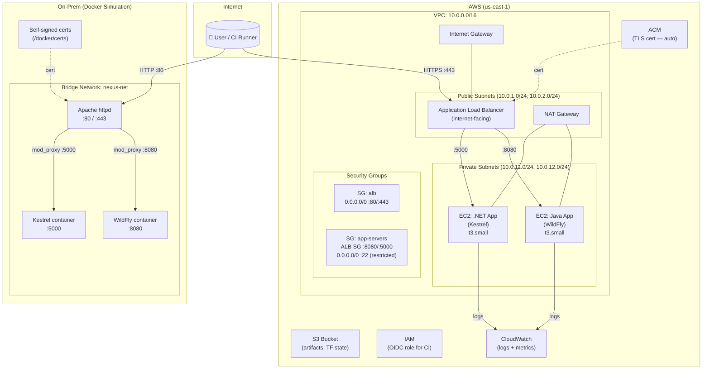
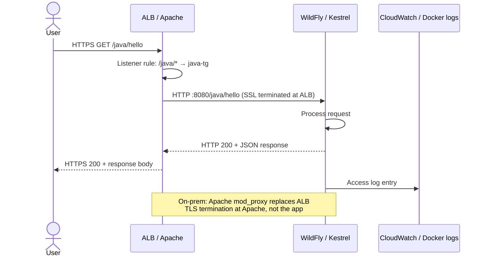
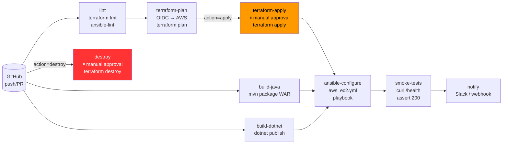
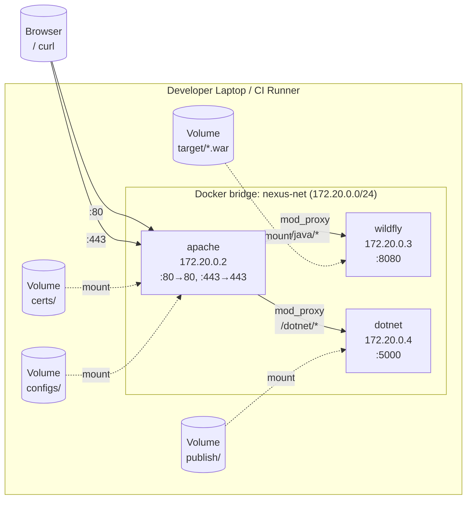
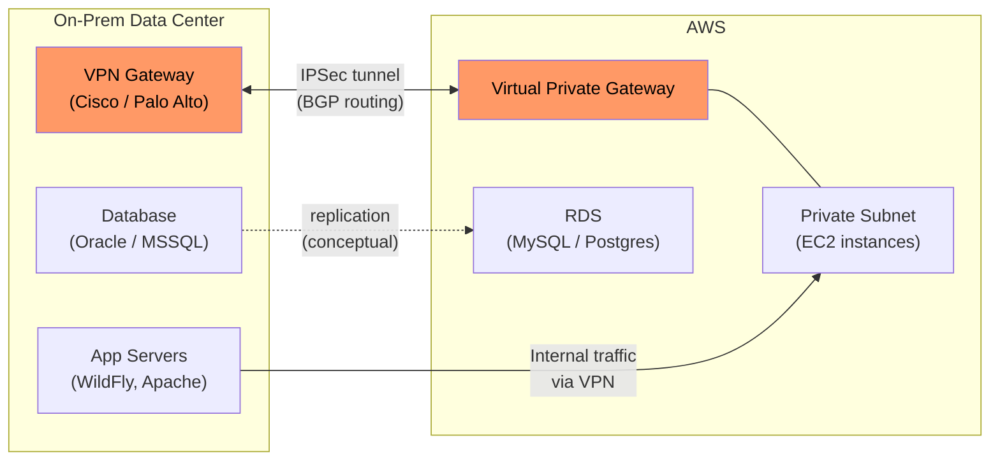

# NexusMidplane — Architecture

## Overview

NexusMidplane is a hybrid infrastructure portfolio project that simulates an enterprise middleware platform straddling on-premises infrastructure and AWS. It demonstrates the operational patterns a middleware/DevOps engineer encounters at financial services companies: dual-tier deployments, load balancing, configuration management, CI/CD pipelines, and the tradeoffs between cloud-managed and self-managed services.

**Stack summary:**

| Layer | On-Prem (Simulated) | AWS |
|---|---|---|
| Runtime | Docker containers (local) | EC2 instances |
| Java app | WildFly (JBoss) | WildFly on EC2 |
| .NET app | Kestrel / .NET 8 | .NET 8 on EC2 |
| Proxy | Apache httpd | Application Load Balancer |
| Networking | Docker bridge network | VPC + subnets + SGs |
| IaC | docker-compose | Terraform |
| Config Mgmt | Ansible (local) | Ansible (AWS dynamic inventory) |
| Certificates | Manual / self-signed | ACM (auto-renewed) |

---

## Network Topology

---

## Data Flow — Request Path

---

## Deployment Pipeline Flow

---

## On-Prem Docker Topology

---

## VPN / Hybrid Connectivity (Conceptual)

In a real enterprise deployment, on-prem servers connect to AWS over a Site-to-Site VPN or AWS Direct Connect. This project simulates that boundary with a split deployment:

> **Portfolio note:** This project uses Docker locally to simulate the on-prem tier and AWS for the cloud tier. The VPN is represented architecturally; in a real engagement, Terraform's `aws_vpn_connection` and `aws_customer_gateway` resources would provision the tunnel.

---

## Key Design Properties

| Property | Decision | Rationale |
|---|---|---|
| **IaC** | Terraform | Declarative, AWS-native, state management |
| **Config mgmt** | Ansible | Agentless, SSH-based, familiar in enterprise |
| **Java app server** | WildFly | Open-source JBoss equivalent, same deployment model |
| **On-prem proxy** | Apache httpd | mod_proxy, mod_ssl, enterprise standard |
| **AWS proxy** | ALB | Managed, auto-scaled, ACM integration |
| **CI/CD** | GitHub Actions | OIDC, no stored keys, AWS-native |
| **On-prem sim** | Docker | Portable, reproducible, no VM overhead |
